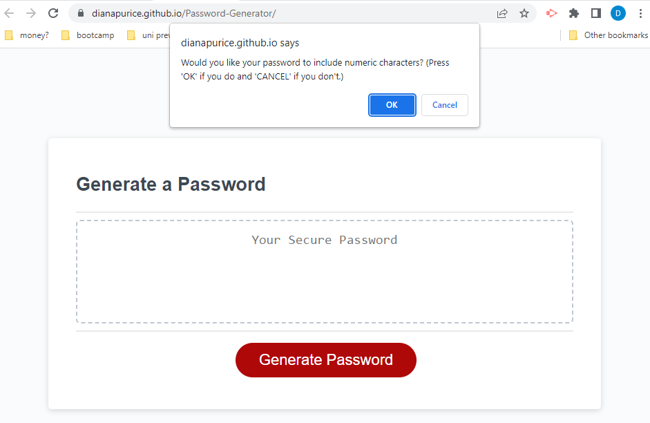

# Password-Generator

## Description

The application generates a password based on the user's criteria.

## Installation

the application does not need any instalation.
it can be viewed at:

## Usage

Press the 'Generate Password' button to start the process.

Enter the length of the password.

Choose if lowercase characters should be used.

Choose if uppercase characters should be used.

Choose if numeric characters should be used.

Choose if special characters should be used.

Get your results.

## Credits

Not applicable.

## License

Please refer to the LICENCE in the repo.
