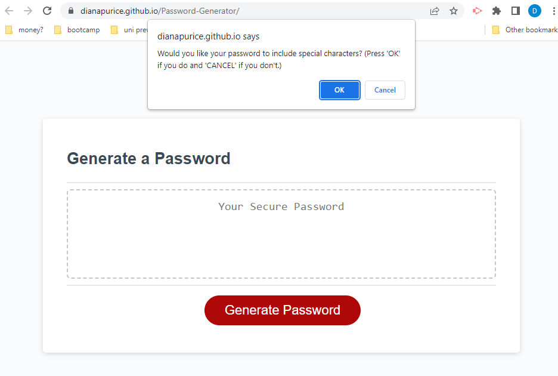
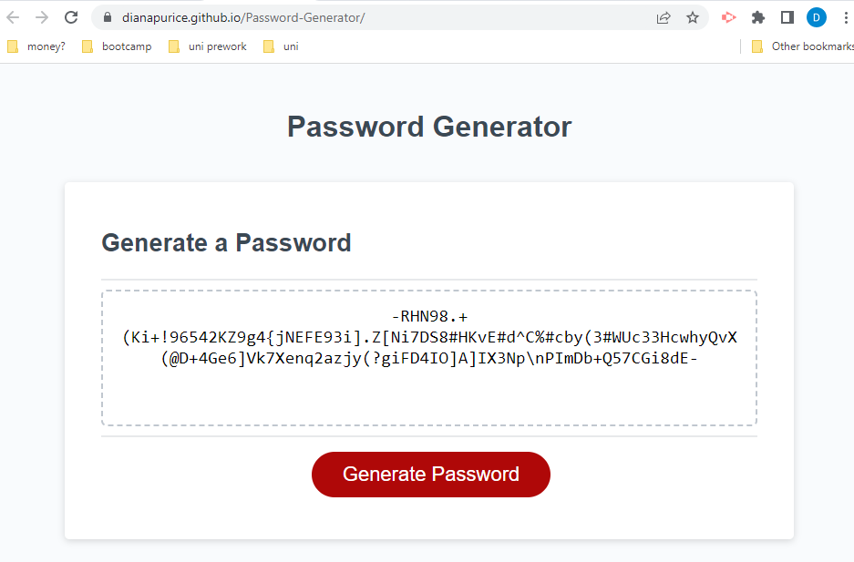

# Password-Generator

## Description

  
The application generates a password based on the user's criteria.

## Installation

  
The application does not need any instalation.
it can be viewed at:

## Usage

  
Press the 'Generate Password' button to start the process.

  
Enter the length of the password.

  
Choose if lowercase characters should be used.

  
Choose if uppercase characters should be used.

  
Choose if numeric characters should be used.

  
Choose if special characters should be used.

  
Get your results.

## Credits

  
Not applicable.

## License

  
Please refer to the LICENCE in the repo.
